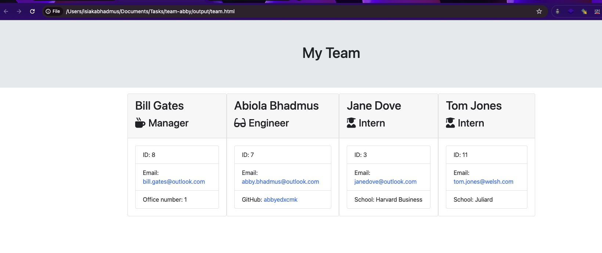
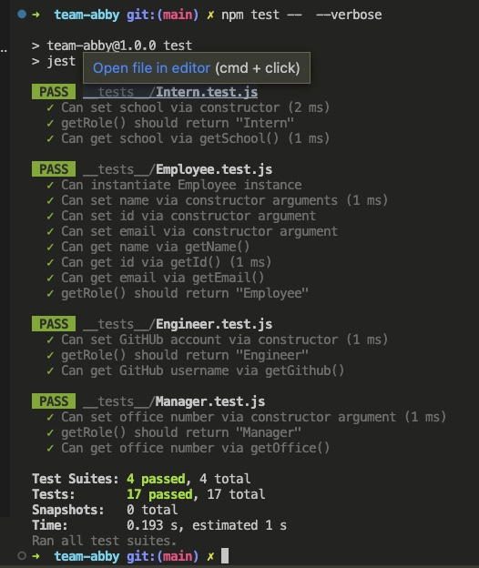
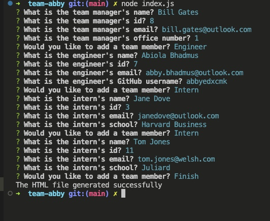

# team-abby


Team-abby is a Team Profile Generator. It is a working Node.js command-line application. It will take in information about employees on a software engineering team, then generates an HTML webpage that displays summaries for each person.

<br>

## User Story

As a manager a user want to generate a webpage that displays my team's basic info so that a user have quick access to their emails and GitHub profiles.

<br>

## Installation

1. Clone the github repository
```bash
git clone https://github.com/abbyedxcmk/team-abby
```
2. Enter the directory `team-abby`
```bash
cd team-abby
```
3. Install node dependencies
```bash
npm install
```

## Run the App

To execute the app do as follows:
```bash
node index.js
```
The user will be asked to fill out the information required. Once all the inputs are given, the user can select 'Finish' upon which an HTML file will be generated in the `output/` directory.

<br>

## Testing 

### Automated Tests

In the `__tests__/` directory there are four test files that are using [Jest package](https://www.npmjs.com/package/jest). To execute the tests, run the command:
```bash
npm test -- --verbose
```
The results should be similar to this output:



### Manual Testing

- Input information test


- Output HTML file verification


## Technologies Used

1. [NodeJS](https://nodejs.org/en)
2. [Inquirer package](https://www.npmjs.com/package/inquirer)
3. [Jest package](https://www.npmjs.com/package/jest)

## Copyright

© Abiola Bhadmus 2024.